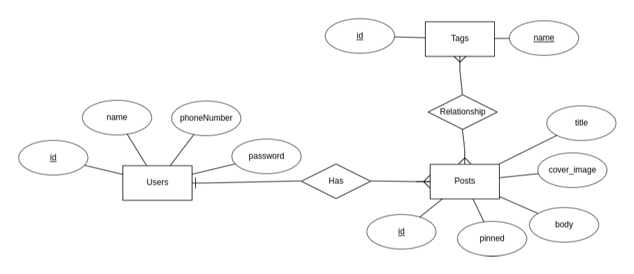

# laravel-backend-task
This is a simple posts/tags API with user authenication created in PHP and Laravel Framework.

## The Entity Relationship Diagram

## Task Description
- [x] create a new Laravel Project (version 9).
- [x] use MySQL Database.
- [x] Make an authentication system using Sanctum.
  1. [x] token has an expiration of 14 days.
  2. [x] with scheduled task to prune the expired tokens.  
- [x] create `/register` API that receive and validate (name, phone number, password).
- [x] create `/login` API.
- [x] create tags API resource, where:
  1. [x] Authenticated users can view all tags.
  2. [x] Authenticated users can store new tags.
  3. [x] Authenticated users can update single tag.
  4. [x]  Authenticated users can delete single tag.
- [x] create posts API resource, where: 
  1. [x] Authenticated users can view only their posts.
  2. [x] Authenticated users can store new posts.
  3. [x] Authenticated users can view a single post of their posts.
  4. [x] Authenticated users can update single post of their posts.
  5. [x] Authenticated users can update single post of their posts.
  6. [x] Authenticated users can delete (Softly) single post of their posts.
  7. [x] Authenticated users can view their deleted posts.
  8. [x] Authenticated users can restore one of their deleted posts.
  9. [x] Pinned posts appear first for every user.
  10. [x] All the received data for storing and updating posts should be validated.
- [x] Create a Job that runs daily and force-deletes all softly-deleted posts for more than 30 days.
- [x] Create a job that runs every six hours and makes HTTP Request to this end endpoint and log only the results
`https://randomuser.me/api/`
- [x] Make /stats API endpoint that shows
   1. [x]  number of all users
   2. [x]  number of all posts 
   3. [x]  number if users with 0 posts

